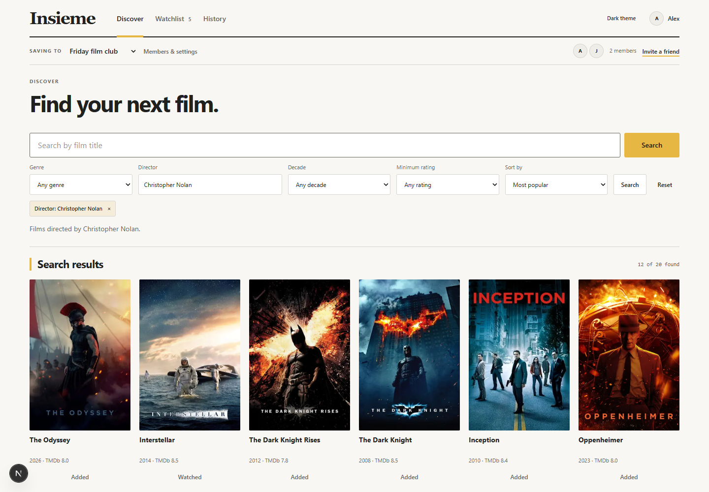
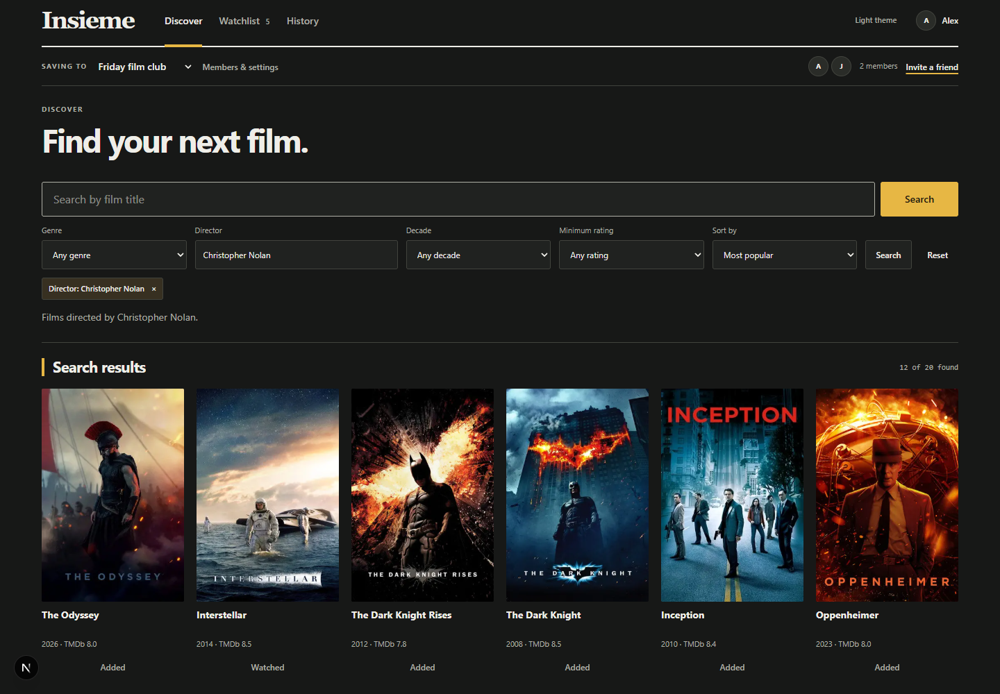
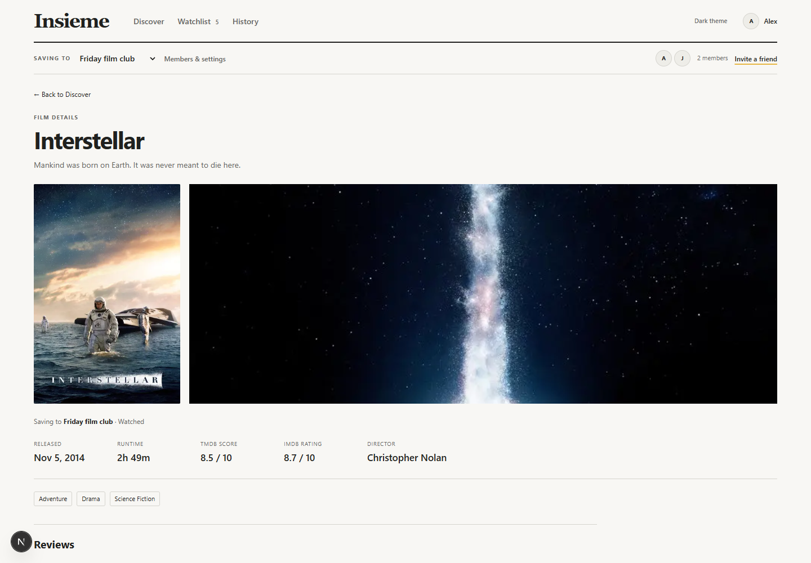
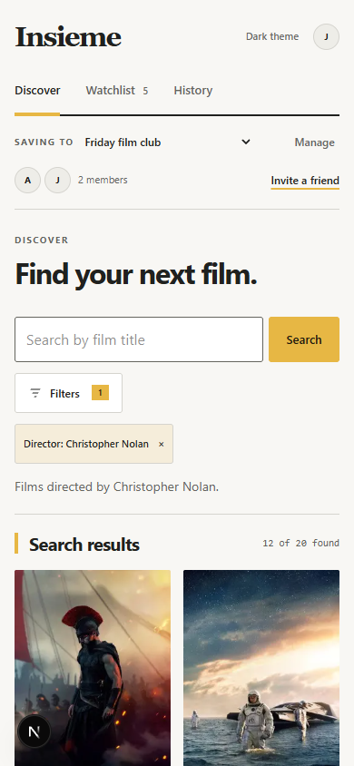
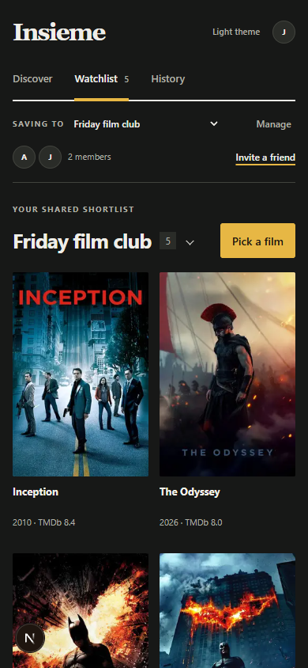

# Film catalog redesign verification

Branch: `codex/film-catalog-redesign` · Linear: BLA-7 · 12 September 2026

## Baseline and scope

Inspected `CONTEXT.md`, `DESIGN.md`, `ROADMAP.md`, authentication and discovery documentation, route handlers, Supabase migrations, search, film details, Watchlist mutations, invitations, reviews, profiles and the running authenticated interface before editing. The starting tree was clean on `main`.

The original interface combined discovery and two collapsible lists, required a query before displaying films, and used modal-only film details. The existing data model already supported multiple Watchlists, owner/member roles, invitations, watched history, member reviews, profile editing, legacy import and the random picker. Those behaviors and all database migrations remain in place. Work used disposable accounts against the confirmed local Insieme instance on port 55321. No production data or deployment was changed.

## Automated checks

- ESLint and TypeScript.
- Production `next build`, including the dynamic `/films/[id]` route.
- 13 unit tests: picker cycles, rating parsing, result collection and safe authentication destinations.
- `node scripts/verify-auth.mjs`: profiles, Watchlist creation/switching, owner rename/delete, member leave, invitations, shared history, reviews, session persistence, logout and outsider RLS isolation.
- `node scripts/verify-catalog.mjs`: real default discovery, combined director/decade/minimum score filters, descending scores, film details, invalid API inputs and film-page login return.

## Browser checks

Tested desktop at 1440 × 1000 and mobile at 390 × 844, with a narrow-screen check at 320px. Both light and dark themes use real TMDb artwork and data.

- Signup and login; opening a film while signed out returns to that film after login.
- Title search, combined filters, minimum-score provenance, empty results, mobile filter application, Escape dismissal and URL-persisted selections.
- Dedicated film pages, real facts, cast, stills and trailer embed; return to the original search.
- Add a film, remove it and Undo; picker opens details and Escape returns focus to its trigger.
- Mark watched, open History, save reviews and use arrow keys to adjust the rating.
- Create and select a Watchlist, generate an invitation, signup through that invitation in a second browser session and join it on mobile.
- Second member sees shared history and can save their own review.
- Deliberately abort the Watchlist request, verify an explicit error rather than a false empty list, restore the network route and recover with Retry.
- Inspect image loading, horizontal overflow, theme persistence, reduced-motion behavior, console and framework errors.

## Findings and limits

The sandbox initially denied image downloads; the same application loaded artwork after the development server was run with network access. No image-optimization workaround was added.

The local realtime publication contains `watchlist_movies`, but two browser sessions did not reliably receive socket updates. The application now refreshes after subscription, on focus/visibility return and every 15 seconds while visible. Automatic cross-session removal recovery was verified without refocusing or reloading the receiving session. Instant socket delivery is not claimed.

Invitation generation now exposes a selectable link as well as copying it, so denied clipboard access does not block the flow. Film mutations disable conflicting actions while pending. Broken poster URLs have an explicit fallback.

Screenshots below are local verification captures, not seeded product data.

