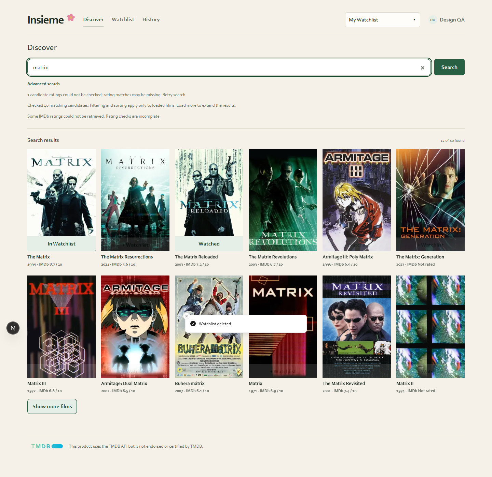
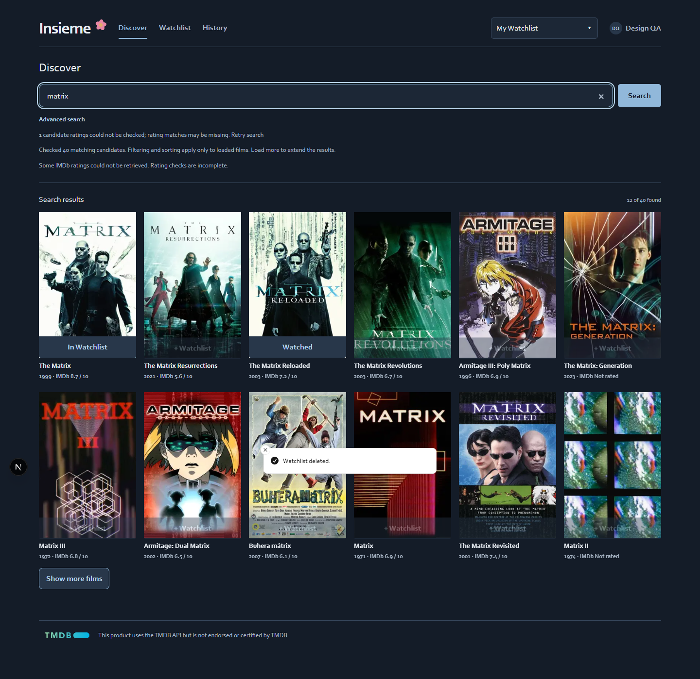
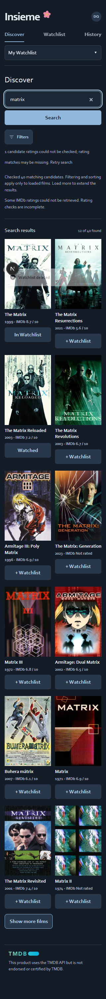
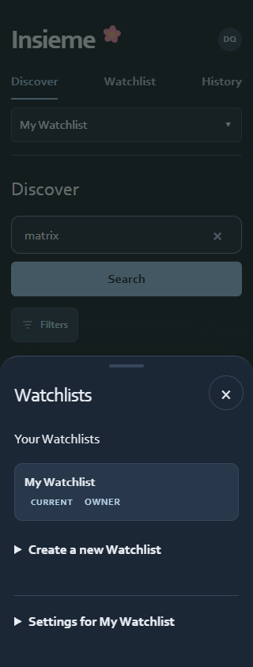

# Production design refinement

Branch: `production-design-refinement` · Linear: BLA-9 · 13–14 September 2026

## Baseline and scope

The working tree was clean. The requested branch already existed at `04b1350`; after fetching origin it was fast-forwarded to current main, `dcec824`. The separate main worktree and reference branch were preserved. `codex/film-catalog-redesign` was inspected for card layout and fallback behavior, never merged. Read the product/domain/tracker/design documentation and inspected the authenticated production-baseline interface before editing.

Implemented persistent top sections, a contextual Watchlists dialog, compact poster cards, keyboard/hover/touch adding, and shared semantic light/dark colors. Kept the production logo, font family, cream/green identity, current IMDb logic, filters, modal film details, auth, memberships, invitations, history, reviews, random picker and Undo. No database migration, popular feed, new film route, push or deployment.

Testing used disposable accounts against the existing **local Insieme Supabase at port 55321**, with real film-provider data. Production data was not modified.

## Automated and browser evidence

- 26 unit tests passed, covering existing picker, IMDb provider/cache and result collection behavior.
- ESLint passed. Production build passed, including TypeScript and generation of all 17 existing pages. An initial standalone TypeScript run encountered obsolete generated prototype route types; a clean Next build regenerated the current route types successfully.
- Existing `verify-auth.mjs` passed: profiles, Owner rename/delete, Member leave, invitations, shared history, per-Member reviews, session persistence, logout and outsider RLS isolation.
- Authenticated Chromium desktop at 1440px: six columns, independent add/details controls, hover without layout shift, keyboard reveal, failed add with inline error and retry, successful add, remove/Undo, picker, mark watched, History and active-list statuses.
- Section links and browser Back/Forward preserve the mounted search and filters, with per-section scroll restoration. Sticky navigation prevents navigating to a tab from first losing the original scroll position.
- Touch-emulated Chromium at 390px and 320px: two columns in light/dark, visible single-tap add actions, filters and Watchlists sheets, no horizontal overflow. Mobile filters remain selected across sections.
- Two-user browser flow: create a long-named list, rename it, add in that list, copy an invitation, sign up and join on a 320px touch viewport, save distinct reviews, adjust a rating with arrow keys, verify the Member cannot rename/delete, then leave. Owner deletion was verified separately after the secondary browser context closed.
- Missing/broken poster and long-title edge fixtures retain 2:3 geometry and do not overflow. These two layout-only fixtures are clearly separate from real-provider functional testing.
- Reduced motion disables transitions and sheet animation. Theme controls persist explicit choices across reloads; System uses live OS preference. The initial theme script precedes body content, with CSS system fallback when storage is unavailable.

The committed scripts are local QA tools, not an unattended CI suite. They require Playwright (set `PLAYWRIGHT_PATH` if supplied by an external runtime), `DESIGN_CDP` from `agent-browser get cdp-url`, a running app at localhost:3000 and a disposable authenticated **Design QA** account. `verify-design.mjs` starts with The Matrix saved and The Matrix Reloaded absent; `verify-design-settings.mjs` expects the matrix search populated. Use a fresh disposable account for a repeat run. Do not edit application files while browser checks run: Fast Refresh resets transient test state. No credentials or saved browser sessions are committed.

## Contrast and visual review

The light supporting text was adjusted from `#6A716A` to `#646D64`, retaining its green-gray character while exceeding 4.5:1 on warm paper. Field boundaries were darkened to `#858E82`. Dark tokens follow the approved navy palette. Main/supporting/action text pairs are checked at 4.5:1 or better; field boundary contrast is at least 3:1. Disabled controls are excluded from normal text thresholds.

Reviewed desktop and narrow mobile captures, menus, filters, reviews and poster fallbacks. All captures are local QA, not production data.

## Limits

- Browser coverage is Chromium, including real touch emulation; physical iOS/Android devices, Safari/Firefox and screen-reader software were not tested.
- The external IMDb provider intermittently failed for some candidates; the existing unavailable/rating-scope disclosures remained visible. This is not a claim that every rating was available.
- No deployed-environment verification was performed because deployment was not requested. Existing realtime behavior was preserved; instant cross-device delivery is not claimed.
- Final `next start` successfully launched the production build. Its additional login smoke test could not run: automatic approval review twice failed because its model was at capacity. Authenticated browser evidence above comes from the local development server; the production build and startup are independently verified.
